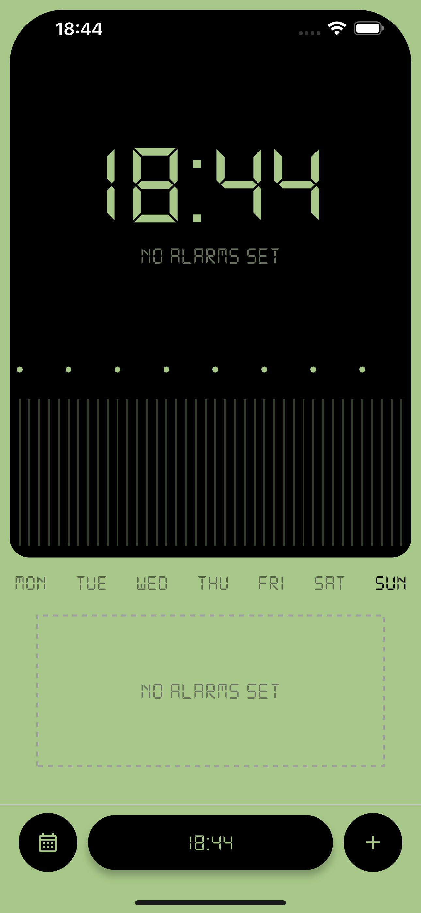
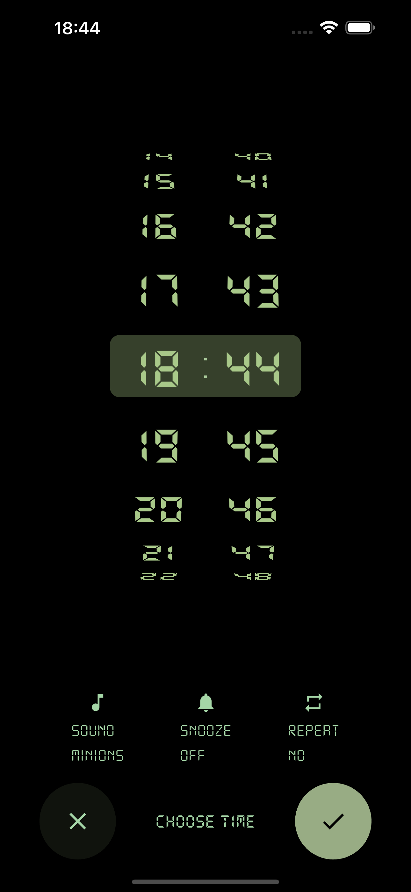
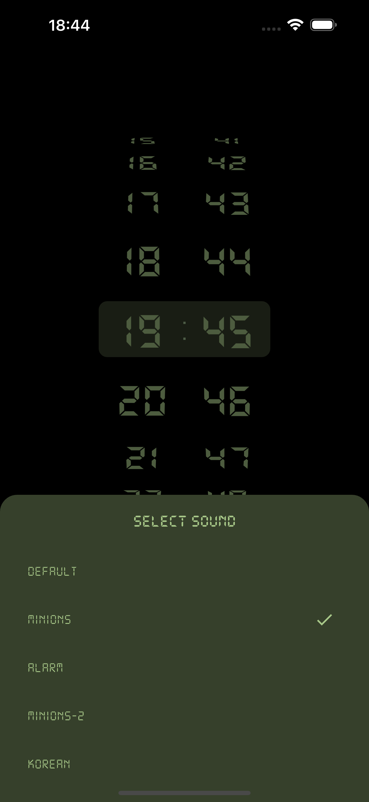
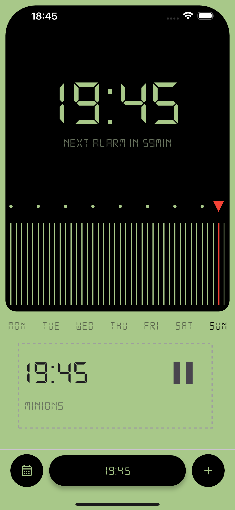
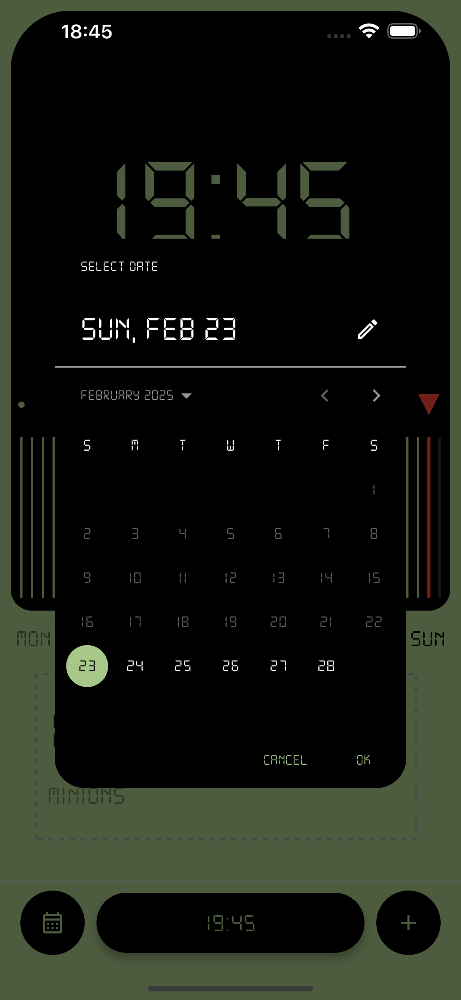

# Digital Alarm

Digital Alarm is a clean and intuitive Flutter alarm clock application designed to help you wake up on time, every time. With a focus on simplicity and customization, Digital Alarm offers a unique user experience with a retro-digital aesthetic.

## Features

-   **Clean and Unique UI:** A visually appealing design with a retro-digital font and a distinctive color scheme.
-   **Easy Alarm Setting:** Intuitive time picker for quick alarm setup.
-   **Customizable Alarm Sounds:** Choose from a variety of alarm sounds, including fun options.
-   **Snooze and Repeat:** Essential alarm features to suit your needs.
-   **Alarm Management:** Easily view and manage your alarms with pause/play controls.
-   **Next Alarm Countdown:** See the time remaining until your next alarm.
-   **Weekday Overview:** A clear visual representation of your weekly alarm schedule.
-   **Progress Bar:** Visual progress bar that shows how much time is left until the next alarm.
-   **Local Notifications:** Get notified even when the app is in the background.
-   **Audio Playback:** Plays selected audio files as alarm sounds.
-   **Date-Specific Alarms:** Set alarms for specific dates using a calendar interface.

## Screenshots

<div align="center">
  
  
  
  
  
</div>

## Getting Started

To get started with Digital Alarm, follow these steps:

1.  **Clone the repository:**

    ```bash
    git clone https://github.com/me-sarvar/digital-alarm
    ```

2.  **Navigate to the project directory:**

    ```bash
    cd digital_alarm
    ```

3.  **Install dependencies:**

    ```bash
    flutter pub get
    ```

4.  **Run the app:**

    ```bash
    flutter run
    ```

## Dependencies

-   `flutter_local_notifications`: For local notifications.
-   `audioplayers`: For audio playback.
-   `dotted_border`: For dotted border effects.

## Contributing

Contributions are welcome! If you find a bug or have an idea for a new feature, please open an issue or submit a pull request.

## License

This project is licensed under the MIT License.

## Future Enhancements

-   Implement date-specific alarms fully.
-   Add swipe-to-delete or edit functionality for alarms.
-   Expand repeat options to include specific days of the week.
-   Allow users to customize snooze duration.
-   Improve error handling for audio playback and notifications.
-   Enhance accessibility features.
-   Add more robust testing.
-   Add subtle animations for transitions and interactions.
-   Explore different icon styles for a more cohesive look.
-   Store sound file information in a configuration file, to more easily add new sounds.

## Support

If you have any questions or issues, please feel free to contact us.

## Author

Juraev Sarvar

## Acknowledgements

-   Thanks to the Flutter community for their support and resources.
-   Thanks to the maintainers of the dependencies used in this project.
-  Inspired by CodeWithDarkwa